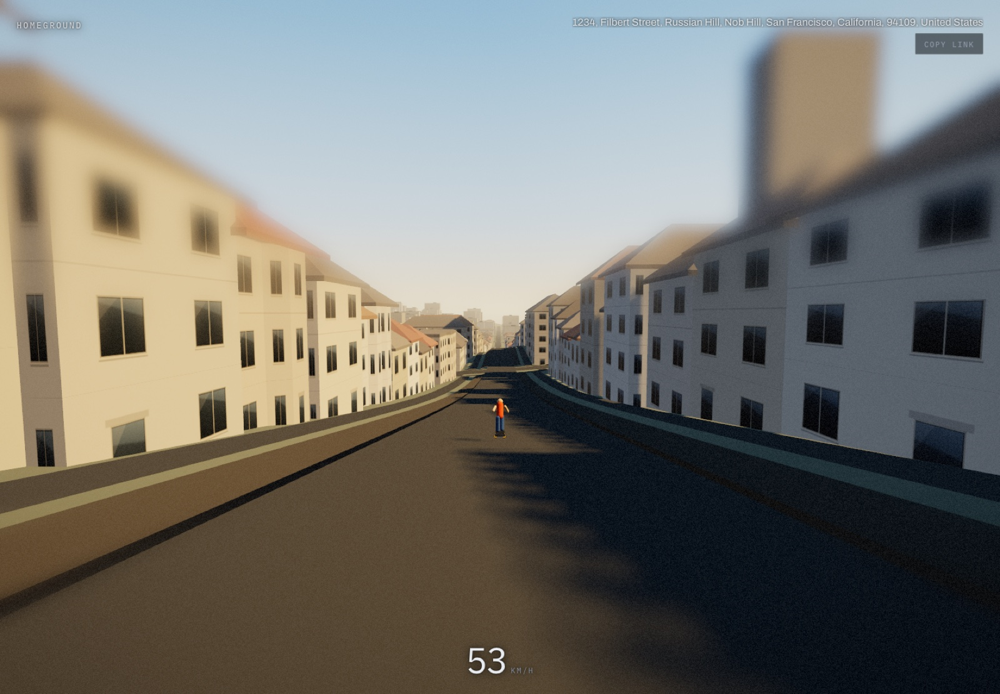
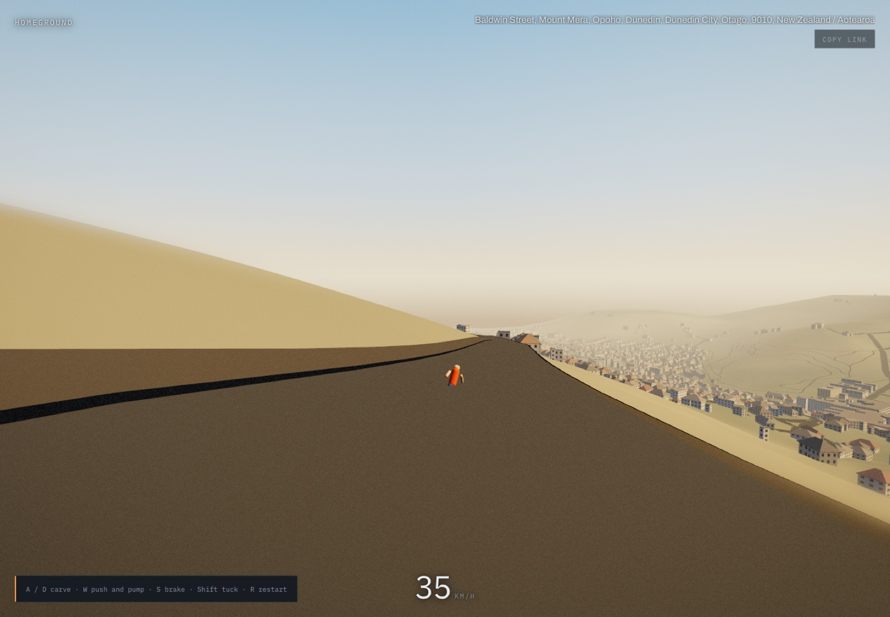
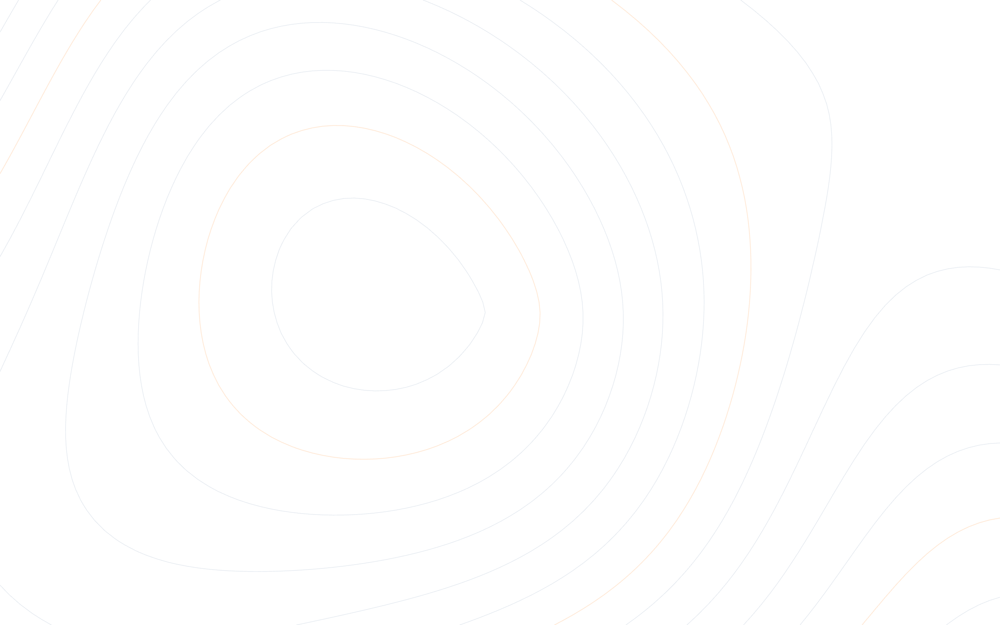
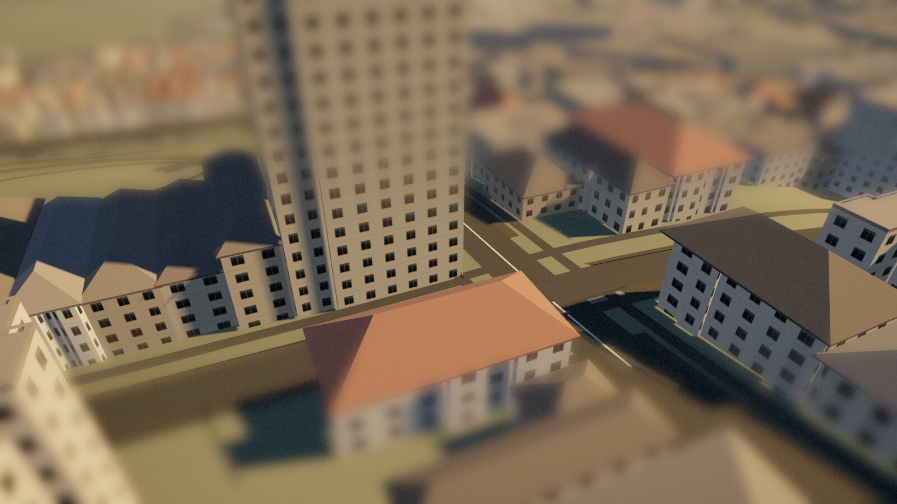

# Homeground

Type your home address. Ten seconds later you're riding a longboard down your own
street, rebuilt from open map data as a playable level you can share with a link.



<sub>Filbert Street, San Francisco. Every footprint, roofline and road centerline above is real OpenStreetMap data; the hill is real NED 10 m elevation. Nothing here is modelled by hand.</sub>

```
npm ci               # or npm install
npm run dev          # web on :5173, api on :8787
open http://localhost:5173
```

`npm run build` typechecks the whole repo and produces `dist/`.

---

## What it actually does

1. **Geocode** — Nominatim turns the address into a lat/lon.
2. **Fetch** — Overpass returns every building footprint and road centerline in a
   1 km box; OpenTopoData returns a 33×33 elevation grid over the same box.
3. **Normalize** — the server projects all of it into local metres (Y up, +X east,
   +Z south, origin at the geocoded point), classifies each building and road, and
   writes the whole tile to `.cache/` keyed by lat/lon snapped to 3 decimal places.
4. **Build** — the browser extrudes the footprints with procedural facades driven by
   the OSM tags, lays road ribbons with curbs and markings along the real
   centerlines, and builds a terrain mesh from the elevation grid. The entire
   neighbourhood is **11 draw calls**.
5. **Ride** — a capsule-on-heightfield integrator at a fixed 120 Hz, colliding
   against the real building footprints, with a chase camera that widens its FOV
   with speed.

Coordinates and the wire format are defined once in [`src/types.ts`](src/types.ts).



<sub>Baldwin Street, Dunedin, New Zealand, the steepest residential street in the world. Outside the United States there is no NED coverage, so the tile falls back to SRTM 90 m automatically. Same URL, same ten seconds.</sub>

Measured on the San Francisco tile above (Apple silicon, Chrome, WebGPU backend,
1920×1080): 6 529 buildings, 956 215 triangles, 11 draw calls, and a steady
**120 fps** — 8.3 ms mean frame interval, 10.3 ms at the 95th percentile, which is
the display's refresh rate rather than the renderer's ceiling. Tile build takes
~380–900 ms of that once the JSON has arrived.

## The "find the run" heuristic — read this before believing anything

`server/runs.ts` is **a heuristic, not a solver.** It makes no optimality claim and
it can and does miss the objectively best line down a hill.

It walks a 1 m-snapped graph of road vertices greedily downhill, then scores each
walk with

```
drop*3 + min(len,800)/80 + gradeSweetSpotBonus + streetFraction*5 - turnPerMeter*150
```

scaled by `1/(1 + distanceFromAddress/600)` and spatially deduped at 150 m. The
proximity term is multiplicative on purpose: a subtractive penalty is meaningless
when scores run in the hundreds (San Francisco) and overwhelming when they run in
the teens (Indianapolis).

Two honest consequences:

- **In a flat city there is no good run**, and the heuristic says so with a low
  score rather than inventing one. Indianapolis's best candidate is a 4 m drop over
  345 m — you spawn on a real street, roll, and have to pump to keep moving.
- **The run can start far from your front door.** In Cow Hollow the nearest real
  descent is 840 m south in Pacific Heights, and that is where it drops you,
  because that is where the hill is.

## Upstream services and how this stays polite

Every upstream is free, keyless, and shared. Homeground is built to not be a bad
citizen of them:

- **Every request carries a real `User-Agent`** (`HG_USER_AGENT` in `.env.example`).
  Set a contact URL in it before running this anywhere but localhost — that is an
  OSM usage-policy requirement, not a suggestion.
- **All upstream calls are globally serialized** — one in flight at a time, process
  wide — and back off on 429/5xx.
- **Everything is cached to disk forever** under `.cache/`, and the cache key *is*
  the tile origin, so neighbouring addresses share one tile. Cold is 14–31 s end
  to end (11 sequential elevation calls at OpenTopoData's 1 req/s cap, plus
  however long Overpass takes that minute — measured 13.8 s for San Francisco,
  31.0 s for Indianapolis); warm is 13–85 ms server-side.
- OpenTopoData's public API caps at 100 locations per request; a 33×33 grid is 11
  requests. `HG_GRID` tunes it.

Data: buildings and roads © OpenStreetMap contributors (ODbL). Elevation via
opentopodata.org (USGS 3DEP `ned10m`, NASA SRTM `srtm90m`).

ODbL requires that credit to reach the person looking at the derived work, not
just the person reading this file, so the app itself carries it too — a permanent
line in the bottom-left of both the landing screen and the ride, linking to
[openstreetmap.org/copyright](https://www.openstreetmap.org/copyright).

## Controls

| | |
|---|---|
| `A` `D` / `←` `→` | carve |
| `W` / `↑` / `Space` | tap to push, hold while carving to pump |
| `S` / `↓` | footbrake |
| `Shift` | tuck |
| `R` | respawn at the top of the run |
| `Esc` | back to the address field |

Touch: either edge carves, the middle strip pushes, two fingers brake.

Feel lives in [`src/game/tuning.ts`](src/game/tuning.ts) — one mutable `TUNING`
object, live-editable from the console (`__hg.game`, `__hg.world`, `__hg.step(n)`).

## Sharing

Entering a world rewrites the URL to `?lat=..&lon=..&addr=..`; **Copy link** puts
that on the clipboard. Opening it restores the exact spot straight into the ride.

## Failure modes, all of which are visible rather than silent

| Case | What you see |
|---|---|
| Address not found | "That address isn't on the map." |
| Overpass/Nominatim busy or down | "The map data source isn't answering." |
| Box has zero buildings (farmland, sea) | "Nothing is built here." |
| Elevation source returns a flat/empty grid | Refused, with the reason — the server would rather fail than ship a fake plane |
| No WebGPU **and** no WebGL2 | "This browser can't draw the world." |

WebGPU is used when available; three.js falls back to WebGL2 automatically and the
page says so in a notice.

## Look development

The frame is meant to read as a warm architectural model of a real
neighbourhood, not as a map. Four decisions carry most of that, and each one is
tuned against a screenshot rather than a principle:

- **The key light rakes across the run, not behind it.** `sunAzimuthFor` in
  `src/main.ts` aims the sun 74° off the direction you are travelling. Aiming it
  straight down the street puts the whole ride in one canyon's shadow; aiming it
  directly behind the camera is worse, because every surface you can see is then
  a lit surface and the frame has no modelling at all.
- **Elevation is a ceiling as well as a floor.** At 30° a 15 m terrace throws a
  26 m shadow, and a street is about 20 m kerb to kerb, so the entire carriageway
  — the biggest surface in frame — goes dead. 40° lands the shadow line down the
  middle of the road.
- **Key-to-fill is about 4:1** (`sun` 4.1 against a `HemisphereLight` at 0.62,
  no ambient term). Fill above that lifts every cast shadow back to within a few
  percent of the lit road and the shadows stop reading even though they are
  being drawn correctly.
- **The grade is not neutral.** `src/world/postfx.ts` adds saturation, a mild
  S-curve, and a split tone that cools the shadows toward the sky and warms the
  highlights toward the sun. Real tilt-shift photographs of cities are more
  saturated and more contrasty than the scene in front of the lens; that excess
  is what makes a real street look like a painted model.



<sub>The loading screen is not a spinner. It is a live contour field, marching squares over a scalar elevation field, with every fifth line drawn as an amber index contour, which is the real cartographic convention. As the tile loads, a radial cone blends in and the contour interval tightens, so the page visibly converges into a hill while the world is being built.</sub>

### The arrival

Entering a place is a 2.6 s drone shot that flies down into the riding seat
(`ChaseCamera.beginIntro`, tuned by the `intro*` block in `src/game/tuning.ts`),
with the tilt-shift band swept from a sliver to the riding width as it descends
(`sweepFocus` in `src/main.ts`). This exists because the run heuristic puts you
at the *top of a hill*, which in practice is a wide junction with the buildings
set back — the single flattest frame in the tile, arrived at as a hard cut. The
same spot from 98 m up is a neighbourhood. `prefers-reduced-motion` skips it.



<sub>Two thirds of the way down the arrival, from about 40 m. The narrow focus
band is what makes a real city block read as a model of one.</sub>

## Known limits

- **Elevation is 33×33 over 2 km — roughly 62 m per sample.** Real driveway lips,
  curb cuts and humpback bridges are smoothed out of existence, which is why air
  time is short (~0.1 s). That is a data resolution limit, not a physics one.
- Overlapping road *surfaces* at junctions are coplanar and can z-fight. A real
  junction-polygon network is the correct fix and a much bigger job.
- **One footprint in 114 can swallow you.** Driving a collision circle 12 m straight
  into a wall finds geometry `slideCircle` cannot resolve — a courtyard block in Cow
  Hollow, reachable by sliding around its own corner. 1/114 walls on that tile, 0 on
  the other five. You would have to ram a specific building head-on to hit it, and
  `R` respawns you. The harness gates this at a 1% rate rather than pretending it is
  zero.
- The rider mesh is placeholder-grade stylization; it reads fine at chase distance.
- Terrain is a fixed ~385² grid regardless of relief, so a flat tile costs the same
  as a hilly one. It is one draw call and the GPU does not notice.

## Tests

```
npx tsx src/game/test-physics.ts   # 10 physics checks incl. an analytic terminal-speed solve
npx tsx server/runs.test.ts        # run-scorer assertions
npx tsx src/world/harness.node.ts  # builds every cached tile headless and checks the meshes
npx tsx src/world/lookdev.test.ts  # shadow-frustum guard, see below
```

`lookdev.test.ts` exists because of a bug that cost the app every cast shadow it
ever had, silently. `LightShadow.updateMatrices` consumes
`shadow.camera.projectionMatrix` as-is and never rebuilds it, so setting
`.left/.right/.far` without calling `updateProjectionMatrix()` leaves the
`DirectionalLightShadow` default in force — a 10 × 10 m ortho box with `far = 500`
— while the light sits 700 m away. Every caster falls outside the frustum, the
shadow map renders empty, and nothing anywhere throws. The test unprojects the
frustum corners and asserts the half-width is the one that was asked for.

`/src/world/harness.html` renders a cached tile with the real look-dev stack for
look development (`?tile=`, `?cam=orbit|street|top`, `?post=0`, `?gl=1`).
